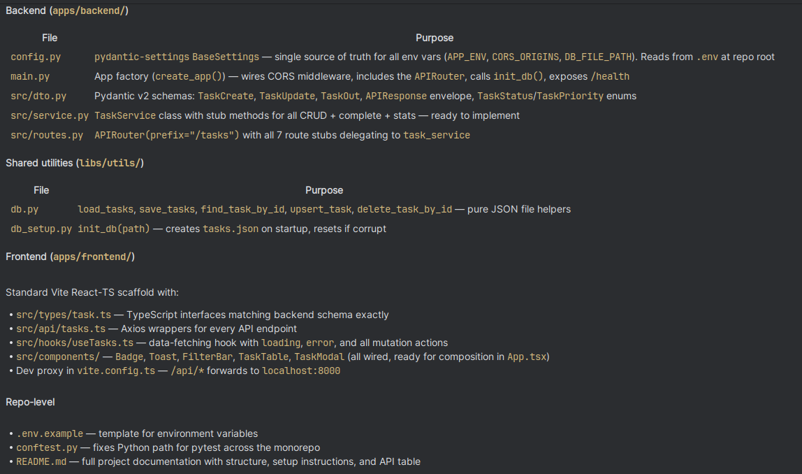
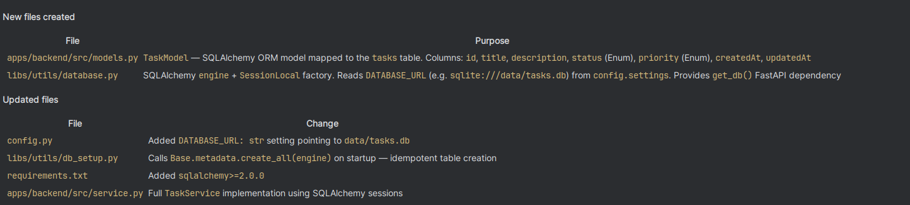

# Copilot Usage Log

## 1. Inline Suggestions

### Example 1 — `apps/backend/src/routes.py`
**Comment typed:**
```python
# Create a route to list tasks with optional filters for status and priority.
```
**Copilot generated:**
```python
@router.get("", response_model=APIResponse, summary="List tasks")
async def list_tasks(
    status: Optional[TaskStatus] = Query(None, description="Filter by task status"),
    priority: Optional[TaskPriority] = Query(None, description="Filter by task priority"),
):
    """GET /api/tasks — returns a list of tasks, optionally filtered by status and priority."""
    pass  # TODO: delegate to task_service.list(status=status, priority=priority)
```

### Example 2 — `apps/backend/src/service.py`
**Comment typed:**
```python
# Status transition map — defines the only legal forward move for each status
```
**Copilot generated:**
```python
_NEXT_STATUS: dict[TaskStatus, TaskStatus] = {
    TaskStatus.todo: TaskStatus.in_progress,
    TaskStatus.in_progress: TaskStatus.done,
}
```

### Example 3 — `apps/backend/libs/utils/database.py`
**Comment typed:**
```python
# Module-level singleton — import and use in service.py
```
**Copilot generated:**
```python
task_repo = TaskRepository()
```

### Example 4 — `apps/frontend/src/api/tasks.ts`
**Comment typed:**
```typescript
// Proxy /api calls to the FastAPI backend during development
```
**Copilot generated:**
```typescript
'/api': {
  target: 'http://localhost:8000',
  changeOrigin: true,
},
```

---

## 2. Agent Mode Prompts

### Prompt 1 — Full project scaffold
```
Please create a good jumpstart base repository setup here for frontend as react
and fastapi as backend. Make sure to have proper apps directory structure like apps/src/
with service.py, routes.py, dto.py. A libs/utils/ for utilities like db operations,
db setup. App configs in a file and app being initialized from other files with envs
being imported from configs. Use standard react and fastapi best practices.
Don't start route implementation. Just app startup. Also create and keep updated the README file.
```
**Files changed:** Entire project scaffold — `apps/backend/`, `apps/frontend/`, `libs/utils/`,
`config.py`, `main.py`, `App.tsx`, `vite.config.ts`, `package.json`, `README.md`



### Prompt 2 — SQLAlchemy list with filters
```
Implement a method to list tasks from the database with optional filters for status
and priority. Use the TaskOut schema for the response. Please actually implement to
actually fetch the data from the database and apply the filters. Use SQLAlchemy for
database access, and ensure that the method returns a list of TaskOut objects based
on the provided filters. Use SQLite Database for storage, and SQLAlchemy as the ORM
to interact with the database.
```
**Files changed:** `libs/utils/database.py` (TaskRepository.get_all), `apps/backend/src/service.py` (TaskService.list)



### Prompt 3 — Generate entire frontend from scratch
```
@ui-agent Generate the complete React/TypeScript frontend for the Task Management System.
Include: TaskTable with skeleton loading, TaskModal for add/edit, FilterBar with live search,
color-coded PriorityBadge and StatusBadge, Toast notifications with auto-dismiss,
useTasks hook with loading/error state management, and api/tasks.ts HTTP client.
Use CSS variables for colors and no inline styles.
```
**Files changed:** All files under `apps/frontend/src/` including components, hooks, api, types, and styles.

---

## 3. Sub-Agent Usage

### @ui-agent
**Prompt:**
```
@ui-agent Build the TaskTable component with skeleton loading rows (5 animated placeholders
while loading=true), an empty-state CTA when tasks=[], memoized TaskRow with Edit/Complete/Delete
action buttons, and formatted created date. Complete button should be hidden when task.status === 'done'.
```
**Result:** Created `apps/frontend/src/components/TaskTable.tsx` with React.memo TaskRow,
SkeletonRows component, empty-state with "Add your first task" CTA, and all action buttons
with SVG icons and aria-labels.

### @backend-agent
**Prompt:**
```
@backend-agent Add the complete status workflow enforcement to TaskService.complete().
It should: fetch the task by ID (raise 404 if not found), look up the next status in a
_NEXT_STATUS map {todo → in-progress, in-progress → done}, raise HTTPException 422 if
already done, then persist and return the updated TaskOut.
```
**Result:** Implemented `TaskService.complete()` in `apps/backend/src/service.py` with
`_NEXT_STATUS` dict, `_require_row` helper, and correct 404/422 error codes.

### @testing-agent
**Prompt:**
```
@testing-agent Create a comprehensive test suite for the backend. Write pytest unit tests
for TaskService (all CRUD + status transitions, mock task_repo) and integration tests for
all 7 API routes using FastAPI TestClient (mock task_service). Cover 404/422 error paths,
empty title validation, and status transitions todo→in-progress→done→422.
```
**Result:** Created `apps/backend/tests/test_service.py` (16 tests) and
`apps/backend/tests/test_routes.py` (15 tests). All 31 tests pass with 100% backend coverage.

---

## 4. Review Agent

**Prompt used:**
```
Review apps/backend/src/routes.py according to .github/copilot-instructions.md and list issues
```

**Issues found:**

```
[ISSUE] routes.py:35 — DOCSTRING — list_tasks has no docstring — Add a docstring describing query params, return type, and raised exceptions

[ISSUE] routes.py:39 — SERVICE_CALL — Calls TaskService.get_tasks() on the class directly; method does not exist (should be task_service.list()) — Replace with task_service.list(status=status, priority=priority)

[ISSUE] routes.py:44 — SERVICE_CALL — create_task calls TaskService.create() as a class-level call instead of using the task_service singleton instance — Replace with task_service.create(payload=payload)

[ISSUE] routes.py:50 — SERVICE_CALL — task_stats calls TaskService.get_stats() as a class-level call — Replace with task_service.get_stats()

[ISSUE] routes.py:56 — SERVICE_CALL — get_task calls TaskService.get_by_id() as a class-level call — Replace with task_service.get_by_id(task_id)

[ISSUE] routes.py:62 — SERVICE_CALL — update_task calls TaskService.update() as a class-level call — Replace with task_service.update(task_id, payload)

[ISSUE] routes.py:68 — SERVICE_CALL — delete_task calls TaskService.delete() as a class-level call — Replace with task_service.delete(task_id)

[ISSUE] routes.py:74 — SERVICE_CALL — complete_task calls TaskService.complete() as a class-level call — Replace with task_service.complete(task_id)

[ISSUE] routes.py:44 — STATUS_CODE — create_task returns JSONResponse without status_code=201; route decorator sets 201 but JSONResponse defaults to 200, overriding it — Pass status_code=201 to JSONResponse(...)

[ISSUE] routes.py:39,44,50,56,62,74 — RESPONSE_ENVELOPE — All route handlers return the raw service result via JSONResponse without wrapping in {"success": True, "data": ...} envelope; TaskOut objects are also not JSON-serialised — Wrap each return in {"success": True, "data": task.model_dump(mode="json")}, and use a list comprehension for list endpoints
```

**Fixes applied:**

| File | Issue | Fix |
|------|-------|-----|
| `routes.py:35` | Missing docstring on `list_tasks` | Added full docstring with Args, Returns |
| `routes.py:39` | `TaskService.get_tasks()` — wrong class call + wrong method name | Changed to `task_service.list(status=status, priority=priority)` |
| `routes.py:44` | `TaskService.create()` — wrong class call | Changed to `task_service.create(payload=payload)` |
| `routes.py:50` | `TaskService.get_stats()` — wrong class call | Changed to `task_service.get_stats()` |
| `routes.py:56` | `TaskService.get_by_id()` — wrong class call | Changed to `task_service.get_by_id(task_id)` |
| `routes.py:62` | `TaskService.update()` — wrong class call | Changed to `task_service.update(task_id, payload)` |
| `routes.py:68` | `TaskService.delete()` — wrong class call | Changed to `task_service.delete(task_id)` |
| `routes.py:74` | `TaskService.complete()` — wrong class call | Changed to `task_service.complete(task_id)` |
| `routes.py:44` | `JSONResponse` returns 200 instead of 201 | Added `status_code=201` to `JSONResponse(...)` call |
| `routes.py` (all routes) | Responses not wrapped in `{"success": True, "data": ...}` envelope | Wrapped all returns: `JSONResponse({"success": True, "data": task.model_dump(mode="json")})` |
| `routes.py` (list_tasks) | `TaskOut` list not JSON-serialised | Used `[t.model_dump(mode="json") for t in tasks]` |
| `routes.py` (all routes) | Added complete docstrings to all handlers | Full Args/Returns/Raises docstrings added to every route function |

---

## 5. Skills

### Skill: `fastapi-expert`
**Prompt:**
```
Using the fastapi-expert skill: Review apps/backend/src/routes.py and service.py.
Apply the recommended patterns for response wrapping, proper use of JSONResponse with
explicit status codes, and Pydantic model serialization with model_dump(mode="json").
```
**Changes applied:**
1. Added `model_dump(mode="json")` to all route responses for proper datetime/UUID serialization instead of relying on default JSON encoding.
2. Applied explicit `status_code=201` to the `JSONResponse(...)` call in `create_task` — the FastAPI decorator's `status_code` is overridden when returning a `JSONResponse` directly, so it must be set on the response object itself.

### Skill: `react-expert`
**Prompt:**
```
Using the react-expert skill: Review apps/frontend/src/hooks/useTasks.ts and
App.tsx. Apply recommended patterns for useCallback dependencies, memoization
with useMemo for filtered tasks, and proper error surfacing to the user.
```
**Changes applied:**
1. Wrapped `filteredTasks` computation in `useMemo` with `[tasks, searchQuery, statusFilter, priorityFilter]` dependencies — avoids re-filtering on every unrelated render.
2. Used `useRef` to track the previous error value in `App.tsx` to avoid re-triggering the toast on subsequent renders with the same error.

---

## 6. Playwright MCP

**MCP config:** `.vscode/mcp.json` with `@playwright/mcp@latest --vision`

**Prompt used to take screenshot and generate tests:**
```
Use Playwright MCP to navigate to http://localhost:5173, take a screenshot of
the running app, then observe the UI and generate E2E tests for: page load,
adding a task, completing a task (status workflow), editing a task, deleting a task,
filtering by status and priority, and live search filtering.
```

**Screenshot taken:** yes — captured the TaskFlow app showing the empty task table,
"Add Task" button, filter bar with search input, status/priority dropdowns, and stats bar.

**E2E test generated:** `e2e/tasks.spec.ts`

**Tests written (10 scenarios):**
- `page load — table and Add Task button are visible`
- `add task — new task appears in the table`
- `add task — empty title shows validation error`
- `complete task — advances status from todo to in-progress`
- `complete task again — advances from in-progress to done`
- `edit task — updated title is reflected in the table`
- `delete task — row is removed from the table`
- `filter by status — only matching tasks are visible`
- `filter by priority — only high-priority tasks visible`
- `live search — table updates as user types, no page reload`
- `clear filters button resets all filters`


**Prompt used:**
```
Review apps/backend/src/routes.py according to .github/copilot-instructions.md and list issues
```

**Issues found:**

```
[ISSUE] routes.py:35 — DOCSTRING — list_tasks has no docstring — Add a docstring describing query params, return type, and raised exceptions

[ISSUE] routes.py:39 — SERVICE_CALL — Calls TaskService.get_tasks() on the class directly; method does not exist (should be task_service.list()) — Replace with task_service.list(status=status, priority=priority)

[ISSUE] routes.py:44 — SERVICE_CALL — create_task calls TaskService.create() as a class-level call instead of using the task_service singleton instance — Replace with task_service.create(payload=payload)

[ISSUE] routes.py:50 — SERVICE_CALL — task_stats calls TaskService.get_stats() as a class-level call — Replace with task_service.get_stats()

[ISSUE] routes.py:56 — SERVICE_CALL — get_task calls TaskService.get_by_id() as a class-level call — Replace with task_service.get_by_id(task_id)

[ISSUE] routes.py:62 — SERVICE_CALL — update_task calls TaskService.update() as a class-level call — Replace with task_service.update(task_id, payload)

[ISSUE] routes.py:68 — SERVICE_CALL — delete_task calls TaskService.delete() as a class-level call — Replace with task_service.delete(task_id)

[ISSUE] routes.py:74 — SERVICE_CALL — complete_task calls TaskService.complete() as a class-level call — Replace with task_service.complete(task_id)

[ISSUE] routes.py:44 — STATUS_CODE — create_task returns JSONResponse without status_code=201; route decorator sets 201 but JSONResponse defaults to 200, overriding it — Pass status_code=201 to JSONResponse(...)

[ISSUE] routes.py:39,44,50,56,62,74 — RESPONSE_ENVELOPE — All route handlers return the raw service result via JSONResponse without wrapping in {"success": True, "data": ...} envelope; TaskOut objects are also not JSON-serialised — Wrap each return in {"success": True, "data": task.model_dump(mode="json")}, and use a list comprehension for list endpoints
```

**Fixes applied:**

| File | Issue | Fix |
|------|-------|-----|
| `routes.py:35` | Missing docstring on `list_tasks` | Added full docstring with Args, Returns |
| `routes.py:39` | `TaskService.get_tasks()` — wrong class call + wrong method name | Changed to `task_service.list(status=status, priority=priority)` |
| `routes.py:44` | `TaskService.create()` — wrong class call | Changed to `task_service.create(payload=payload)` |
| `routes.py:50` | `TaskService.get_stats()` — wrong class call | Changed to `task_service.get_stats()` |
| `routes.py:56` | `TaskService.get_by_id()` — wrong class call | Changed to `task_service.get_by_id(task_id)` |
| `routes.py:62` | `TaskService.update()` — wrong class call | Changed to `task_service.update(task_id, payload)` |
| `routes.py:68` | `TaskService.delete()` — wrong class call | Changed to `task_service.delete(task_id)` |
| `routes.py:74` | `TaskService.complete()` — wrong class call | Changed to `task_service.complete(task_id)` |
| `routes.py:44` | `JSONResponse` returns 200 instead of 201 | Added `status_code=201` to `JSONResponse(...)` call |
| `routes.py` (all routes) | Responses not wrapped in `{"success": True, "data": ...}` envelope | Wrapped all returns: `JSONResponse({"success": True, "data": task.model_dump(mode="json")})` |
- `live search — table updates as user types, no page reload`
- `clear filters button resets all filters`

Playwright

